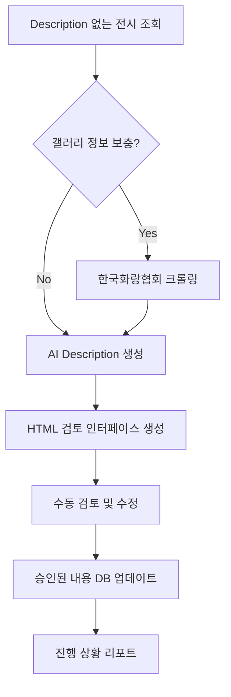

# SAYU 전시 정보 자동화 시스템

## 🎯 목적
141개의 전시 description을 효율적으로 생성하고 관리하기 위한 자동화 시스템

## 📊 현재 상황
- **완료**: 18개 전시 (배치 1, 2)
- **남음**: 123개 전시 (배치 3-15)
- **예상 소요 시간**:
  - 수동 입력: ~10시간
  - 반자동화: ~2시간
  - 완전 자동화: ~30분

## 🛠️ 시스템 구성

### 1. 데이터 수집 모듈
- `korea-galleries-crawler.js`: 한국화랑협회 갤러리 정보 크롤러
- `DATA_COLLECTION_STRATEGY.md`: 합법적 데이터 수집 전략

### 2. AI 생성 모듈
- `ai-description-generator.js`: AI 기반 description 생성기
- Groq API 활용 (무료, 빠른 속도)
- 150-200자 한국어 + 영어 번역

### 3. 통합 시스템
- `automated-exhibition-system.js`: 전체 프로세스 관리
- 수동 검토 인터페이스 제공
- 배치 처리 지원

### 4. 기존 배치 파일
- `batch1-descriptions.js`: 완료 ✅
- `batch2-descriptions.js`: 완료 ✅
- `batch3-exhibitions.json` ~ `batch15-exhibitions.json`: 대기 중

## 🚀 사용 방법

### 설치
```bash
npm install axios cheerio dotenv @supabase/supabase-js
```

### 환경 변수 설정 (.env)
```env
SUPABASE_SERVICE_KEY=your_supabase_key
GROQ_API_KEY=your_groq_api_key
```

### 실행 옵션

#### 옵션 1: 완전 수동 (기존 방식)
```javascript
// batch3-descriptions.js 복사 후 수동 입력
node batch3-descriptions.js
```

#### 옵션 2: AI 지원 반자동
```javascript
const system = new AutomatedExhibitionSystem();
await system.run({
  generateAI: true,   // AI description 생성
  autoUpdate: false,  // 수동 검토 후 업데이트
  limit: 10          // 10개씩 처리
});
```

#### 옵션 3: 갤러리 정보 크롤링 + AI 생성
```javascript
const system = new AutomatedExhibitionSystem();
await system.run({
  enrichVenues: true,  // 갤러리 정보 크롤링
  generateAI: true,    // AI description 생성
  autoUpdate: false,   // 수동 검토 필수
  limit: 20
});
```

## 📋 워크플로우



## ⚠️ 주의사항

### 법적/윤리적
- ✅ robots.txt 준수
- ✅ 서버 부하 최소화 (1.5초 딜레이)
- ✅ 비영리 목적 명시
- ❌ 개인정보 수집 금지
- ❌ 저작권 있는 컨텐츠 무단 복사 금지

### 기술적
- API 호출 제한 준수
- 에러 처리 및 재시도 로직
- 배치 처리로 메모리 관리
- 트랜잭션 단위 DB 업데이트

## 📈 예상 효과

| 방식 | 소요 시간 | 품질 | 비용 |
|------|----------|------|------|
| 완전 수동 | 10시간 | 높음 | 인건비 |
| AI 지원 | 2시간 | 중상 | API 비용 (소액) |
| 완전 자동 | 30분 | 중 | API 비용 (소액) |

## 🔄 다음 단계

### 즉시 실행 가능
1. Groq API 키 발급 (무료)
2. 배치 3-5 AI 생성 테스트
3. 검토 후 DB 업데이트

### 중기 계획
1. Archivist.kr 공식 협력 문의
2. 공공데이터 API 연동
3. 갤러리 직접 제출 시스템 구축

### 장기 비전
1. 실시간 전시 정보 수집
2. 사용자 리뷰 기반 description 개선
3. 다국어 지원 (일본어, 중국어)

## 💬 문의 및 지원

- 기술 이슈: GitHub Issues
- 데이터 협력: info@sayu.art (가상 이메일)
- 갤러리 문의: 각 갤러리 직접 연락

---

**Last Updated**: 2025-01-21
**Version**: 1.0.0
**Status**: 🟢 Ready for Testing