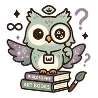
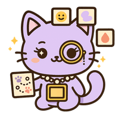
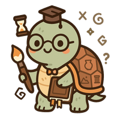
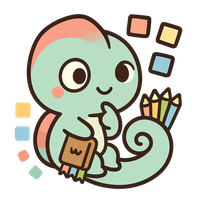
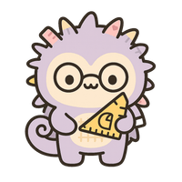
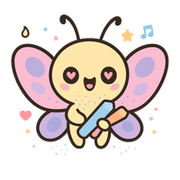
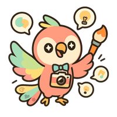
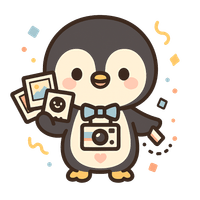
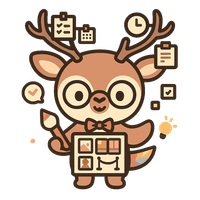

# SAYU - AI-Powered Art Discovery Platform

<div align="center">

**"예술과 나를 연결하다"** | *Connecting Art and Myself*

[](https://sayu.my)
[](https://sayu.my/quiz)

</div>

---

## Overview

SAYU is an AI-powered art discovery platform that connects users with art through personality-based matching. Using the **APT (Art Personality Type)** system with 16 unique types, SAYU creates meaningful connections between individuals and artworks.

### Key Metrics

| Metric | Result | Industry Average |
|--------|--------|------------------|
| Quiz Completion Rate | **100%** | 30-50% |
| Viral Coefficient | **20%** | 5-10% |
| Artworks Integrated | **5M+** | - |

---

## Features

### APT (Art Personality Type) Test
Discover your art personality through a scientifically designed quiz. 16 unique types based on 4 axes:
- **L/S**: Lyrical vs Structural
- **A/R**: Abstract vs Realistic
- **E/M**: Emotional vs Mental
- **F/C**: Free vs Conventional

### AI Art Counselor
Therapeutic conversations mediated by art. AI-powered sessions help users explore emotions through artwork appreciation.

### Global Exhibition Recommendation
Real-time exhibition matching based on APT type and location. "There's a perfect exhibition 500m away from you right now."

### Mood Atlas
A 180-day emotional journey through art. Daily mood tracking with AI-recommended artworks across 7 continents.

---

## Architecture

```
┌─────────────────────────────────────────────────────────────┐
│              Frontend (Next.js 15 + React 19)               │
│                    Deployed on Vercel                        │
└─────────────────────────┬───────────────────────────────────┘
                          │
┌─────────────────────────▼───────────────────────────────────┐
│                   Backend (Express.js)                       │
│               Deployed on Railway (2GB optimized)            │
│  ┌─────────────┬─────────────┬─────────────┬─────────────┐  │
│  │ Art         │ Exhibition  │ APT         │ Mood        │  │
│  │ Counselor   │ Matching    │ Analysis    │ Atlas       │  │
│  └─────────────┴─────────────┴─────────────┴─────────────┘  │
└───────────┬─────────────────────────────────┬───────────────┘
            │                                 │
┌───────────▼───────────┐       ┌─────────────▼─────────────┐
│   Supabase (Primary)  │       │    Railway PostgreSQL     │
│   - Auth (OAuth 2.0)  │       │    - Caching              │
│   - Users & Profiles  │       │    - Background Jobs      │
│   - Exhibitions (RLS) │       │    - Scraping Data        │
│   - AI Recommendations│       └───────────────────────────┘
│   - pgvector Search   │
└───────────────────────┘
```

---

## Tech Stack

### Frontend


### Backend


### AI/ML Integration

| Component | Provider | Purpose |
|-----------|----------|---------|
| Art Counselor | OpenAI GPT-4 | Therapeutic art conversations |
| Quick Response | Groq Llama 3 | Fast recommendations (free) |
| Image Generation | Replicate SDXL | Personal art profiles |
| Vector Search | pgvector | Emotion-based matching |
| **Planned** | Claude Vision | Artwork APT analysis |

### Infrastructure


---

## Project Structure

```
sayu/
├── frontend/              # Next.js 15 application
│   ├── app/               # App Router pages (109 pages)
│   ├── components/        # React components (86 dirs)
│   ├── lib/               # Utilities & API clients
│   └── hooks/             # Custom React hooks (25+)
├── backend/               # Express.js API server
│   ├── src/
│   │   ├── routes/        # API routes (40+)
│   │   ├── services/      # AI/ML services (25+)
│   │   ├── middleware/    # Auth, security, rate limiting
│   │   └── config/        # Database, logging
│   └── tests/             # Jest tests
├── supabase/              # Database migrations (71 tables)
├── shared/                # Shared types & utilities
└── docs/                  # Documentation
```

---

## Getting Started

### Prerequisites
- Node.js 18+
- npm 9+

### Installation

```bash
# Clone repository
git clone https://github.com/yourusername/sayu.git
cd sayu

# Install dependencies
npm install

# Set up environment variables
cp frontend/.env.example frontend/.env.local
# Edit .env.local with your API keys

# Run development server
npm run dev:frontend
```

### Environment Variables

```env
# Supabase
NEXT_PUBLIC_SUPABASE_URL=your_supabase_url
NEXT_PUBLIC_SUPABASE_ANON_KEY=your_supabase_anon_key

# AI Providers
GROQ_API_KEY=your_groq_api_key
OPENAI_API_KEY=your_openai_api_key
REPLICATE_API_TOKEN=your_replicate_token
```

---

## 16 APT Types

SAYU's Art Personality Type system defines 16 unique types, each represented by a spirit animal:

<div align="center">

| | | | |
|:---:|:---:|:---:|:---:|
| <br>**LAEF**<br>몽환적 여우 | <br>**LAMF**<br>심오한 올빼미 | <br>**LAEC**<br>감각적 고양이 | <br>**LAMC**<br>사색적 거북 |
| <br>**LREF**<br>적응적 카멜레온 | <br>**LRMF**<br>다재다능 문어 | <br>**LREC**<br>섬세한 고슴도치 | <br>**LRMC**<br>장인적 비버 |
| <br>**SAEF**<br>자유로운 나비 | <br>**SAMF**<br>표현적 앵무새 | <br>**SAEC**<br>균형잡힌 펭귄 | <br>**SAMC**<br>우아한 사슴 |
| <br>**SREF**<br>충실한 강아지 | <br>**SRMF**<br>지혜로운 코끼리 | <br>**SREC**<br>사교적 오리 | <br>**SRMC**<br>통찰적 독수리 |

</div>

### APT Axes

| Axis | Dimension | Description |
|------|-----------|-------------|
| **L/S** | Lyrical↔Structural | 감성적 표현 vs 구조적 접근 |
| **A/R** | Abstract↔Realistic | 추상적 해석 vs 사실적 묘사 |
| **E/M** | Emotional↔Mental | 감정 중심 vs 이성 중심 |
| **F/C** | Free↔Conventional | 자유로운 탐구 vs 전통적 감상 |

---

## Security

SAYU implements comprehensive security measures:

- **Authentication**: OAuth 2.0 (Google, GitHub) + JWT
- **API Protection**: CSRF, XSS, SSRF prevention
- **Database**: Row-Level Security (RLS) on Supabase
- **Rate Limiting**: 15 req/min for AI endpoints
- **CORS**: Whitelist-based domain control

See [SECURITY.md](./docs/SECURITY.md) for details.

---

## Documentation

- [Architecture Overview](./docs/architecture/)
- [Claude Integration Plan](./docs/architecture/CLAUDE_INTEGRATION_ARCHITECTURE.md)
- [API Documentation (OpenAPI)](./backend/openapi.yaml) - 100+ endpoints documented
- [Security Guidelines](./docs/SECURITY.md)
- [Deployment Guide](./docs/deployment-guide.md)
- [Improvement Roadmap](./docs/ANTHROPIC_SA_PORTFOLIO_IMPROVEMENT_PLAN.md)

---

## Performance

| Optimization | Result |
|--------------|--------|
| Image Size | 73% reduction (200MB → 54MB) |
| Memory Usage | Optimized for Railway 2GB limit |
| API Caching | 5-minute TTL for exhibitions |
| Bundle Size | Dynamic imports for 200KB+ libs |

---

## Roadmap

- [x] APT Personality System (16 types)
- [x] AI Art Counselor
- [x] Global Exhibition Database (5M+ artworks)
- [x] Mood Atlas Journey
- [ ] Claude Vision Integration
- [ ] Multi-language Support (12 languages)
- [ ] Mobile App (React Native)

---

## Contributing

This project is for personal use. Feel free to explore the codebase for learning purposes.

---

## License

Personal use only.

---

<div align="center">

**SAYU** - 예술을 통해 나를 발견하는 여정

*A journey of self-discovery through art*

</div>
